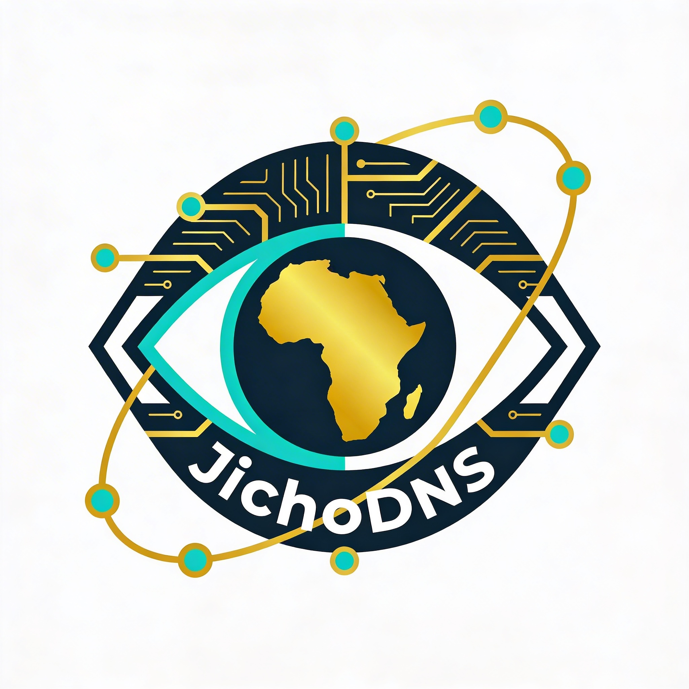

<p align="center">
  
</p>

<h1 align="center">JichoDNS</h1>

<p align="center">
  <strong>Africa-focused DNS threat visibility platform</strong>
</p>

<p align="center">
  <a href="#key-features">Features</a> •
  <a href="#quick-start">Quick Start</a> •
  <a href="#documentation">Docs</a> •
  <a href="#api-access-tiers">API</a> •
  <a href="#contributing">Contributing</a>
</p>

<p align="center">
  
  
  
</p>

---

JichoDNS provides real-time DNS threat intelligence for African networks, aggregating multi-source threat feeds and DNS heuristics (entropy/DGA scoring) to surface C2 infrastructure, data exfiltration, and phishing indicators targeting the continent. (RIPE Atlas active measurements and ML classification are on the roadmap — see [docs/REMEDIATION_BACKLOG.md](docs/REMEDIATION_BACKLOG.md).)

> "Jicho" means "eye" in Swahili - JichoDNS is the watchful eye over Africa's DNS landscape.

## Key Features

- **Interactive Africa Threat Map** - Live attack-arc replay of malicious DNS indicators across African geographies (a per-country/ASN choropleth risk layer is *planned*, not yet implemented)
- **Newly Observed Domains (NOD)** - Track domains less than 20 hours old with risk scoring
- **Multi-Source Intelligence** - Aggregates a dozen threat-feed importers: URLhaus, ThreatFox, Feodo Tracker, SSL Blacklist (+JA3), MalwareBazaar, OpenPhish, PhishTank, AbuseIPDB, AlienVault OTX, crt.sh, and DNSTwist
- **RIPE Atlas Integration** *(planned)* - Active DNS measurements from African vantage points are not yet built; `/api/v1/atlas/*` currently returns HTTP 501
- **Threat Reporting** - Deterministic HTML reports built from Elasticsearch aggregations, with STIX/MISP export (no ML/LLM; Vertex AI classification is *planned*)
- **Typosquatting Detection** - DNSTwist integration for African brand monitoring
- **Infrastructure Correlation** *(planned)* - Shodan-based hosting intelligence is not yet wired in
- **API Access (JWT)** - REST API for SOC/SIEM integration with STIX/MISP export (per-key issuance and usage metering are *planned*; auth is JWT-only today)

## Architecture Overview

```
┌─────────────────────────────────────────────────────────────────┐
│                         DATA SOURCES                             │
├──────────────┬──────────────┬──────────────┬───────────────────┤
│  Abuse.ch    │  PhishTank   │  RIPE Atlas  │     Shodan        │
│  ThreatFox   │  OTX         │              │                   │
└──────┬───────┴──────┬───────┴──────┬───────┴───────┬───────────┘
       │              │              │               │
       ▼              ▼              ▼               ▼
┌─────────────────────────────────────────────────────────────────┐
│                    CELERY WORKERS                                │
│  Feed Import │ Atlas Scheduler │ Enrichment │ ML Scoring        │
└──────────────────────────┬──────────────────────────────────────┘
                           │
         ┌─────────────────┼─────────────────┐
         ▼                 ▼                 ▼
   ┌───────────┐    ┌───────────┐    ┌───────────┐
   │ PostgreSQL│    │ClickHouse │    │   Redis   │
   └─────┬─────┘    └─────┬─────┘    └───────────┘
         └────────┬───────┘
                  ▼
┌─────────────────────────────────────────────────────────────────┐
│                      FASTAPI BACKEND                             │
│  Public API │ User API │ Paid API │ Admin API                   │
└──────────────────────────┬──────────────────────────────────────┘
                           │
         ┌─────────────────┴─────────────────┐
         ▼                                   ▼
┌─────────────────────┐          ┌─────────────────────┐
│   Next.js Frontend  │          │  External API       │
│   (Dashboard)       │          │  Consumers          │
└─────────────────────┘          └─────────────────────┘
```

> **Note:** the diagram shows the *target* architecture. RIPE Atlas, Shodan, ML/Vertex scoring, and the paid-API layer are on the roadmap and not yet implemented — see [docs/REMEDIATION_BACKLOG.md](docs/REMEDIATION_BACKLOG.md).

## Quick Start

### Prerequisites

- Docker & Docker Compose
- *(Optional, for planned integrations only)* RIPE Atlas API key, Shodan API key, Google Cloud/Vertex AI credentials — none are required to run the platform today

### Development Setup

```bash
# Clone the repository
git clone https://github.com/yourusername/jichoDNS.git
cd jichoDNS

# Copy environment template
cp .env.example .env

# Edit .env with your API keys
nano .env

# Start the stack
docker-compose up -d

# Run database migrations
docker-compose exec backend alembic upgrade head

# Access the dashboard
open http://localhost:3000
```

### Environment Variables

```bash
# Planned integrations (not required today — these features are not yet implemented)
RIPE_ATLAS_API_KEY=your_ripe_atlas_key
SHODAN_API_KEY=your_shodan_key
GOOGLE_APPLICATION_CREDENTIALS=/path/to/credentials.json

# Database
POSTGRES_HOST=postgres
POSTGRES_DB=jichodns
POSTGRES_USER=jichodns
POSTGRES_PASSWORD=secure_password

# Optional integrations
VIRUSTOTAL_API_KEY=your_vt_key
ABUSEIPDB_API_KEY=your_abuseipdb_key
```

## Documentation

| Document | Description |
|----------|-------------|
| [Architecture](docs/ARCHITECTURE.md) | System design and component details |
| [API Reference](docs/API.md) | Complete API documentation |
| [Data Sources](docs/DATA_SOURCES.md) | Threat feed integrations |
| [Database Schema](docs/DATABASE.md) | PostgreSQL and ClickHouse schemas |
| [Deployment](docs/DEPLOYMENT.md) | Production deployment guide |
| [Roadmap](docs/ROADMAP.md) | Implementation phases |
| [Monetization](docs/MONETIZATION.md) | Pricing tiers and API access |

## API Access Tiers

| Tier | Price | API Calls | Features |
|------|-------|-----------|----------|
| **Public** | Free | - | View map, basic stats |
| **Registered** | Free | 100/day | Dashboard, lookups, watchlists |
| **Professional** | $299/mo | 50K/mo | Full API, exports, webhooks |
| **Enterprise** | Custom (contact sales) | Unlimited | Bulk, custom feeds, support |

> API access is JWT-authenticated today; per-key issuance and usage metering are *planned* (see [docs/REMEDIATION_BACKLOG.md](docs/REMEDIATION_BACKLOG.md)). Payments are processed via Stripe only.

## Tech Stack

| Component | Technology |
|-----------|------------|
| Backend | FastAPI (Python 3.11+) |
| Frontend | Next.js 14, TypeScript, Tailwind CSS |
| Maps | Mapbox GL JS |
| Database | PostgreSQL 15, ClickHouse |
| Queue | Celery, Redis |
| ML | Planned (reports are deterministic ES-aggregation templates today) |
| Auth | JWT (API-key issuance/metering planned) |
| Payments | Stripe (Paystack planned) |

## Use Cases

### SOC Analyst
- Triage alerts with instant indicator enrichment
- Identify Africa-specific threats
- Generate blocklists for DNS firewalls

### Threat Hunter
- Discover newly observed malicious domains
- Track DGA patterns and campaigns
- Correlate infrastructure across indicators

### Incident Responder
- Scope incidents with IOC expansion
- Build attack timelines
- Export evidence in standard formats

### National CERT
- Monitor threat landscape across all national ASNs
- Track campaigns targeting the country
- Share intelligence with stakeholders

## Contributing

We welcome contributions! Please see [CONTRIBUTING.md](CONTRIBUTING.md) for guidelines.

## License

Apache-2.0 - See [LICENSE](LICENSE) for details.

## Acknowledgments

- [RIPE NCC](https://atlas.ripe.net/) - Atlas measurement infrastructure
- [abuse.ch](https://abuse.ch/) - Threat intelligence feeds
- [Shodan](https://shodan.io/) - Internet intelligence
- [DNSTwist](https://github.com/elceef/dnstwist) - Domain permutation engine
